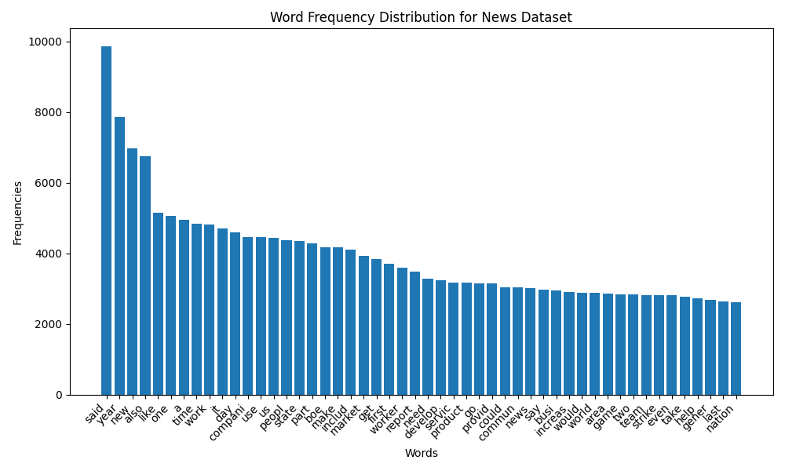
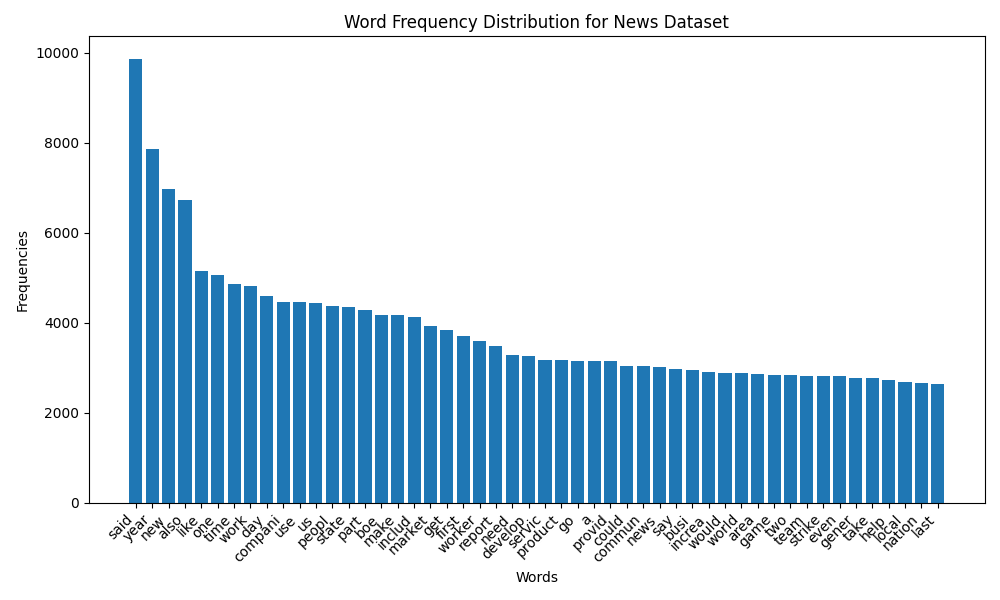
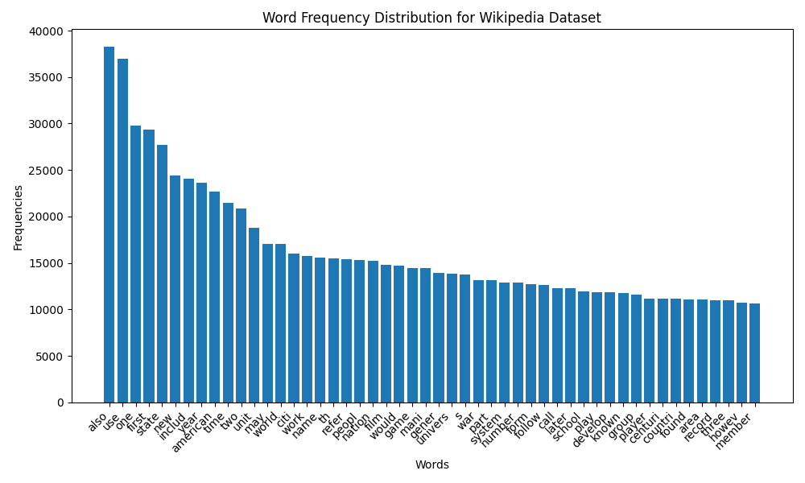
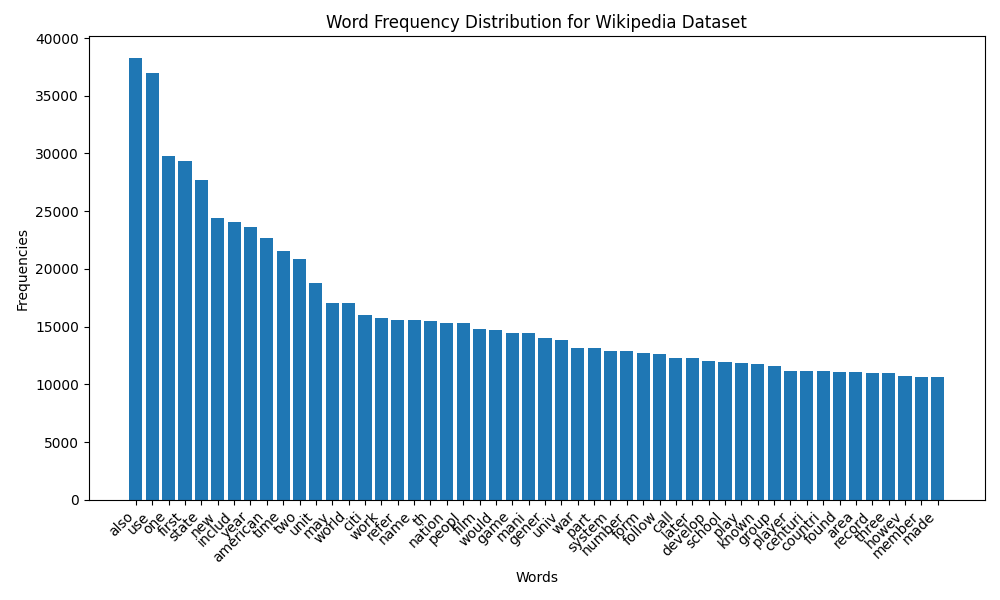
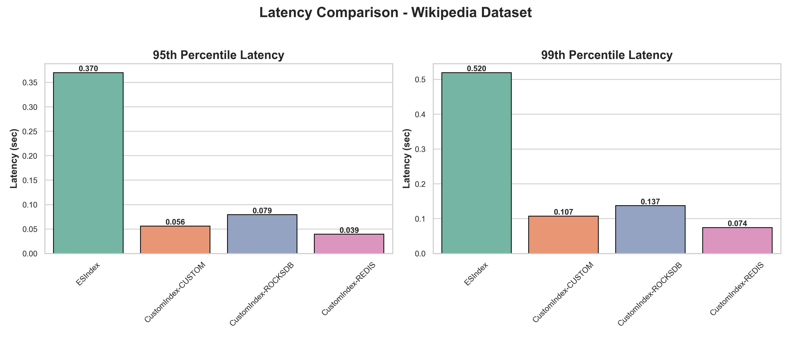
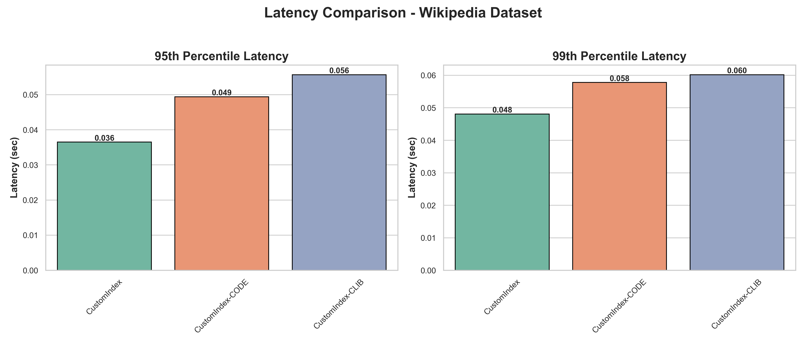
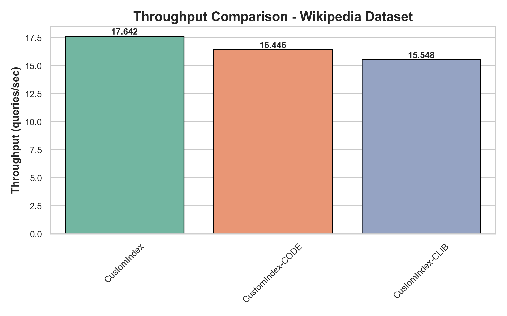
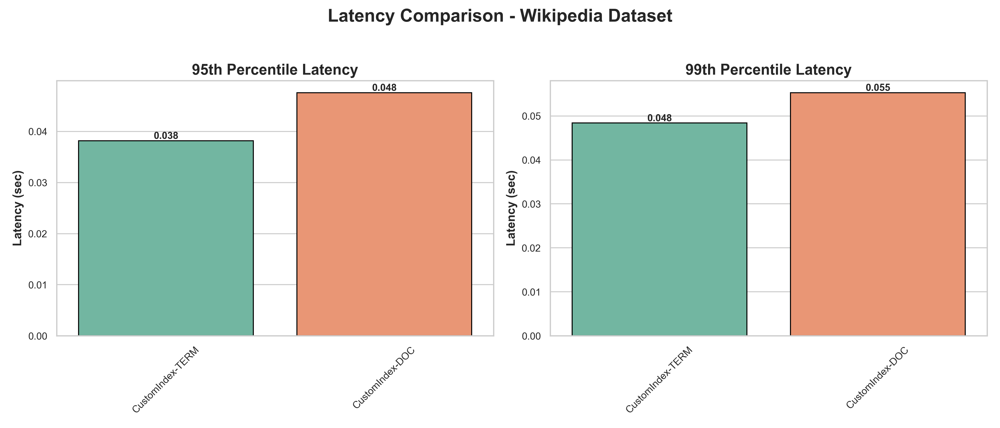
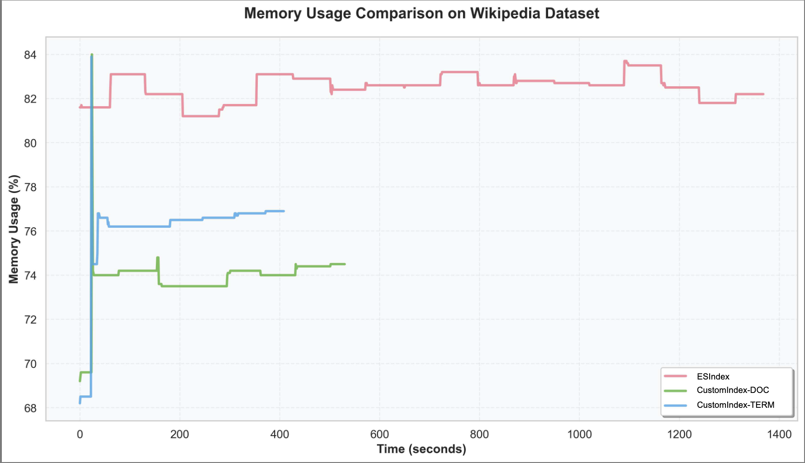
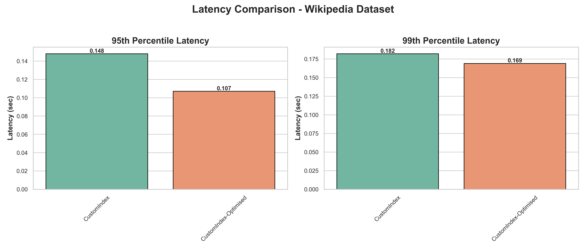

# Report

## Introduction

This section presents the performance evaluation results of our custom information retrieval system compared against Elasticsearch as a baseline. The evaluation encompasses both operational performance metrics (memory usage, latency, throughput) and functional metrics (precision, recall, NDCG, etc.) across different system configurations and datasets.

## Frequency analysis with and without Preprocessing

### News Dataset

| Before Preprocessing | After Preprocessing |
|----------------------|---------------------|
|  |  |

### Wikipedia Dataset

| Before Preprocessing | After Preprocessing |
|----------------------|---------------------|
|  |  |

> We can clearly see that after preprocessing all the stopwords (which earlier skewed the distribution) have been removed and hence the after preprocessed data better represents the content in the documents.

## Memory Usage Analysis

### Memory Footprint Comparison for Different Index Information Types

This analysis compares the memory consumption during index creation across different index information storage strategies (Boolean, Word Count, TF-IDF) on both News and Wikipedia datasets. The comparison includes Elasticsearch as a baseline to understand the memory overhead of our custom implementations.

**What we're plotting:** Memory (RAM) usage percentage over time during index creation for different information storage types.

**Datasets:** News and Wikipedia datasets

**Configurations compared:**

- Elasticsearch Index (baseline)
- Custom Index with Boolean information
- Custom Index with Word Count information  
- Custom Index with TF-IDF information

**Implications drawn from the plots:**

We can clearly see that Elasticsearch index takes a lot less space and a lot less time to run as compared to the custom self index. And BOOLEAN custom index takes much less time as it does not have to go through whole documents to get the word count/tfidf. Whereas the memory required by WORDCOUNT/TFIDF/NORMAL is the same as it does not take much memory to store the word counts and tfidf.

## Latency, Throughput and Memory Footprint Analysis

### Comparison for Different Data Stores

This section evaluates the query execution latency across different data storage backends to understand the performance impact of various storage mechanisms.

**What we're plotting:** 95th and 99th percentile latencies for query execution across different data store implementations.

**Datasets:** News and Wikipedia datasets

**Configurations compared:**

- Elasticsearch Index (baseline)
- Custom Index with Custom data store
- Custom Index with RocksDB data store
- Custom Index with Redis data store

**Implications drawn from the plots:**

The results reveal that Elasticsearch exhibits the highest query latency, primarily attributed to network communication overhead with the Docker-containerized server instance. RocksDB demonstrates comparatively elevated latency due to its internal compression layer, which introduces additional processing overhead. The pronounced tail latency spikes observed at the 95th and 99th percentiles for RocksDB are characteristic of periodic compaction operations inherent to its storage engine architecture. And Redis is slightly lower than custom because of it's inmemory datastructure store.

### Impact of Compression Techniques

This analysis examines how different compression strategies affect query execution latency, providing insights into the trade-offs between storage efficiency and query performance.

**What we're plotting:** 95th and 99th percentile latencies for query execution with different compression methods.

**Datasets:** News and Wikipedia datasets

**Configurations compared:**

- Elasticsearch Index (baseline)
- Custom Index with no compression
- Custom Index with Code compression
- Custom Index with Zlib compression

**Implications drawn from the plots:**

CLib-based compression methods show higher latency because algorithms like DEFLATE or Brotli rely on heavier entropy coding and dictionary-based matching, resulting in greater CPU overhead during decompression. In contrast, simple code-based schemes such as delta encoding and variable-byte decoding operate directly on integer sequences with lightweight bit manipulations, yielding significantly faster decompression.

Throughput measurements further highlight this difference: code-compressed postings achieve higher query throughput due to minimal per-integer decode cost, whereas CLib methods slow down under sustained workloads as each query requires repeated invocation of the costlier decompression routines. Memory footprints also differ, CLib methods compress more aggressively but trade speed for compactness, while code compression offers a balanced size–speed tradeoff optimized for search workloads.

### Query Processing Strategy Performance

This section compares the latency characteristics of Term-at-a-Time (TAAT) versus Document-at-a-Time (DAAT) query processing strategies.

**What we're plotting:** 95th and 99th percentile latencies for different query processing approaches.

**Datasets:** News and Wikipedia datasets

**Configurations compared:**

- Elasticsearch Index (baseline)
- Custom Index with Term-at-a-Time processing
- Custom Index with Document-at-a-Time processing

**Implications drawn from the plots:**

TAAT exhibits higher latency due to repeatedly iterating over full posting lists one term at a time and storage required by accumulators, resulting in redundant updates for the same document across different terms. This per-term scoring overhead accumulates significantly for multi-term queries, leading to slower evaluation.It also requires a larger in-memory accumulator to store partial scores for all documents touched by each term, causing a higher memory footprint, especially for frequent terms with long posting lists. This overhead grows with query length, leading to noticeably higher memory usage during evaluation.

In contrast, DAAT demonstrates lower latency because it processes posting lists in a synchronized, document-aligned manner, computing each document’s score only once. Efficient skipping mechanisms further reduce unnecessary comparisons, allowing DAAT to maintain better throughput under heavy query loads. It also consumes less memory as it processes posting lists in a synchronized document-by-document fashion, requiring only minimal state to advance pointers across lists. The absence of large score tables results in a more compact memory profile, making DAAT better suited for memory-constrained or high-throughput retrieval scenarios.

### Optimization Techniques Impact

This analysis evaluates the effectiveness of various optimization techniques in reducing query execution latency.

**What we're plotting:** 95th and 99th percentile latencies comparing optimized versus non-optimized implementations.

**Datasets:** News and Wikipedia datasets

**Configurations compared:**

- Elasticsearch Index (baseline)
- Custom Index without optimizations
- Custom Index with optimizations enabled

**Implications drawn from the plots:**
The results demonstrate substantial performance improvements when optimization techniques are enabled, with the optimized implementation consistently achieving lower latency across both 95th and 99th percentiles. Key optimization strategies including enhanced posting list traversal algorithms, early termination strategies, improved memory access patterns, and streamlined data flow contribute to reduced query execution time and more consistent performance under varying load conditions, making these optimizations valuable for production deployment scenarios requiring predictable response times.

## Functional Performance Metrics

### Information Retrieval Effectiveness Comparison

This section evaluates the functional performance of our custom index implementations using standard information retrieval metrics.

**What we're measuring:** The following table explains each evaluation metric used to assess information retrieval effectiveness:

| Metric | Description | Formula/Calculation | Interpretation |
|--------|-------------|-------------------|----------------|
| **MAP** (Mean Average Precision) | Average of precision values at each relevant document position across all queries | Average of AP scores for all queries, where AP = average of precision@k for relevant docs | Higher is better; measures ranking quality and precision across entire result set |
| **NDCG@k** (Normalized Discounted Cumulative Gain) | Measures ranking quality considering position and relevance grades | DCG@k normalized by ideal DCG@k; DCG = Σ(rel_i / log₂(i+1)) | Higher is better (0-1 scale); accounts for graded relevance and position bias |
| **Precision@k** | Fraction of relevant documents in top-k results | (# relevant docs in top-k) / k | Higher is better; measures accuracy of top results regardless of total relevant docs |
| **Recall@k** | Fraction of total relevant documents found in top-k results | (# relevant docs in top-k) / (total relevant docs) | Higher is better; measures completeness of retrieval within top-k |
| **F1@k** | Harmonic mean of Precision@k and Recall@k | 2 × (Precision@k × Recall@k) / (Precision@k + Recall@k) | Higher is better; balances precision and recall trade-off |
| **Accuracy@k** | Overall correctness including true negatives | (TP + TN) / (TP + TN + FP + FN) for top-k | Higher is better; less meaningful for IR due to large true negative space |

**Dataset:** News dataset (using Elasticsearch as ground truth)

**Configurations compared:**

- TF-IDF with Term-at-a-Time processing (no optimization)
- TF-IDF with Document-at-a-Time processing (no optimization)
- TF-IDF with Document-at-a-Time processing (optimized)
- Word Count with Term-at-a-Time processing (no optimization)
- Word Count with Document-at-a-Time processing (no optimization)
- Word Count with Document-at-a-Time processing (optimized)

| Config | MAP | NDCG@50 | Precision@50 | Recall@50 | F1@50 | Accuracy@50 |
|--------|-----|---------|--------------|-----------|-------|-------------|
| TFIDF-TERM | 0.4483 | 0.5905 | 0.4820 | 0.5534 | 0.4954 | 0.9986 |
| TFIDF-DOC | 0.4475 | 0.5898 | 0.4808 | 0.5522 | 0.4942 | 0.9986 |
| TFIDF-DOC-OPTIMISED | 0.4475 | 0.5898 | 0.4808 | 0.5522 | 0.4942 | 0.9986 |
| WORDCOUNT-TERM | 0.4294 | 0.5692 | 0.4598 | 0.5312 | 0.4732 | 0.9985 |
| WORDCOUNT-DOC | 0.4337 | 0.5749 | 0.4660 | 0.5374 | 0.4794 | 0.9986 |
| WORDCOUNT-DOC-OPTIMISED | 0.4337 | 0.5749 | 0.4660 | 0.5374 | 0.4794 | 0.9986 |

### Key Findings

**Performance:**

- Elasticsearch: Superior memory efficiency and index creation speed
- DAAT: Lower memory usage
- TAAT: Lower query latency (Usually it should be DAAT due to speed up of using skip pointers)
- Optimizations significantly reduce latency without affecting retrieval quality

**Storage:**

- Custom stores and Redis achieve competitive latency
- RocksDB has higher latency due to compression overhead
- Compression provides storage benefits with minimal latency impact

**Effectiveness:**

- TF-IDF outperforms Word Count (MAP: 0.4483 vs 0.4337)
- Processing strategy choice minimally impacts retrieval quality
- Optimizations maintain effectiveness while improving performance
